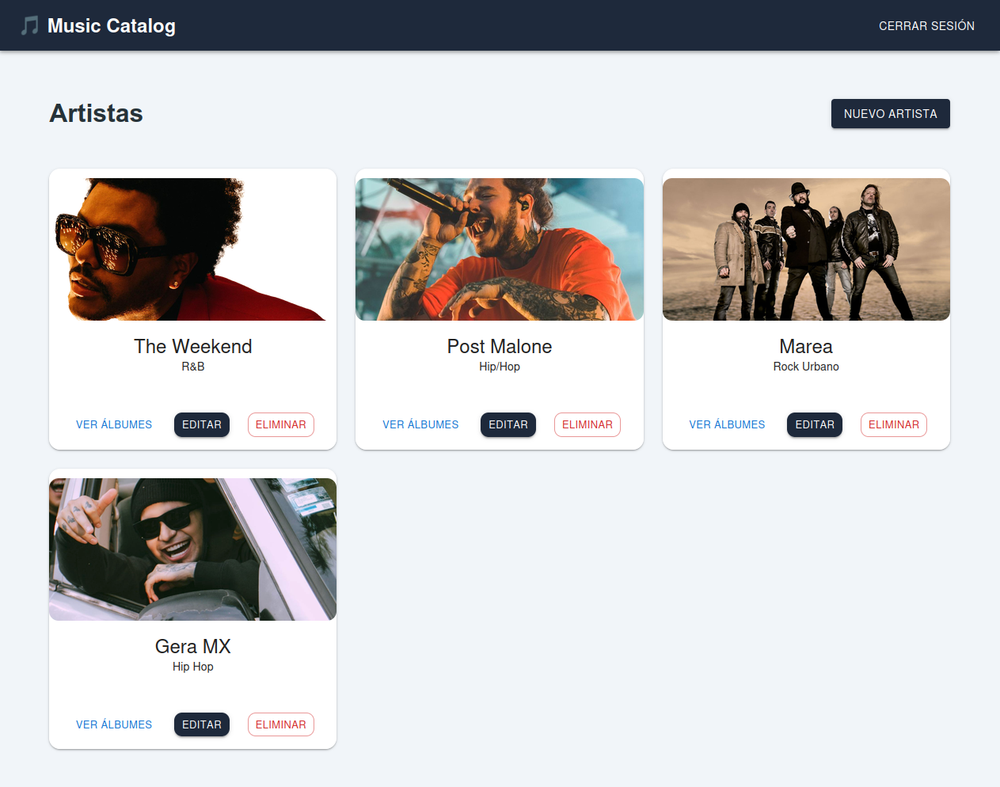

# 🎵 Music Catalog - Frontend



Frontend de la aplicación **Music Catalog**, desarrollado con **React** y **Vite**. Esta aplicación consume una API REST para gestionar artistas y álbumes musicales, ofreciendo una interfaz moderna y responsive.

---

## 🚀 Tecnologías utilizadas

- React
- Vite
- Material UI (MUI)
- React Router DOM
- Axios
- CSS

---

## ✨ Funcionalidades

### Visitante

- Visualizar la lista de artistas.
- Consultar los álbumes de cada artista.

### Usuario autenticado

- Iniciar sesión.
- Cerrar sesión.
- Crear artistas.
- Editar artistas.
- Eliminar artistas.
- Crear álbumes.
- Editar álbumes.
- Eliminar álbumes.

---

## 🎨 Características de la interfaz

- Diseño responsive.
- Navbar de navegación.
- Rutas protegidas.
- Componentes reutilizables.
- Formularios para artistas y álbumes.
- Manejo de autenticación mediante token.
- Consumo de API con Axios.
- Interfaz desarrollada con Material UI.

---

## 📂 Estructura del proyecto

```text
src/
│
├── assets/
├── components/
├── pages/
├── services/
├── App.jsx
├── main.jsx
└── index.css
```

---

## ⚙️ Instalación

Clonar el repositorio:

```bash
git clone https://github.com/sebastiansalazarUisek/artists-album-frontend.git
```

Instalar dependencias:

```bash
npm install
```

Ejecutar el proyecto:

```bash
npm run dev
```

## 🔗 Backend

Este proyecto consume una API REST desarrollada de forma independiente con Django REST Framework.

---

## 👨‍💻 Autor

**Sebastián Salazar**